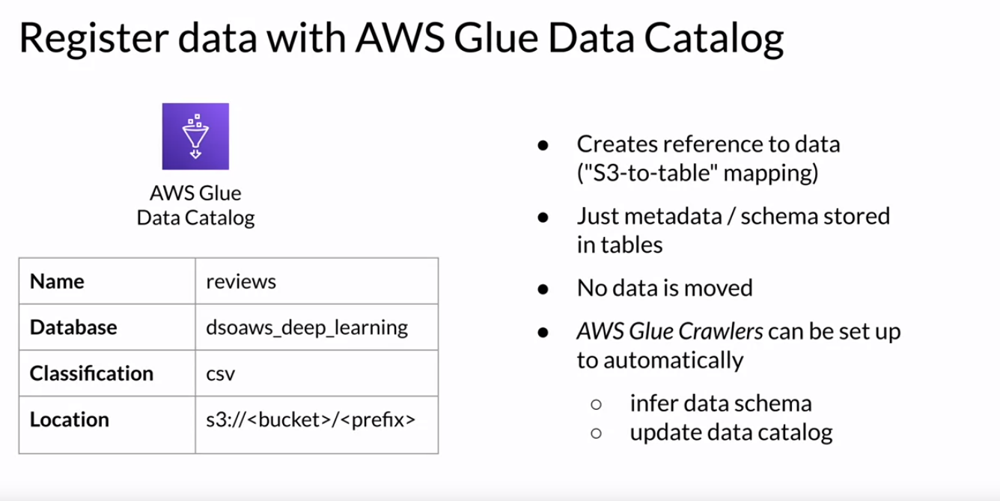
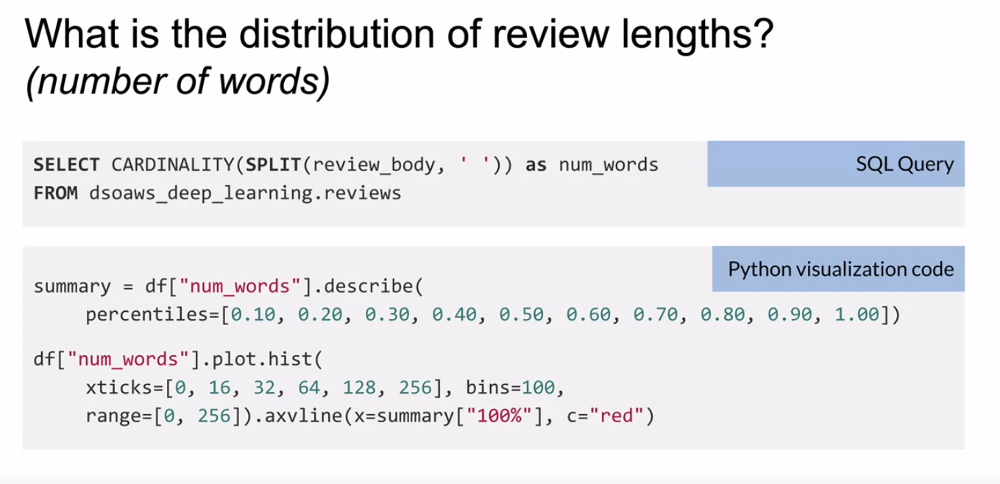

# Course 1 Analyze Datasets and Train ML
## Week 1
### Data ingestion and exploration

1. AWS Data Wragler:

- connects pandas DataFrames and AWS data services
- Load/unload data from data lakes, data warehouses and databases

```py
# !pip install awswrangler

import awswrangler as wr
import pandas as pd

df = wr.s3.read_csv(path='s3://bucket/prefix/')
```

2. AWS Glue Data Catalog

This data catalog service is used to register or catalog the data stored in S3. Similar to taking inventory in a shop, you need to know what data is stored in your S3 data lake, or bucket, as an individual container for objects is called. Using the Data Catalog Service, you create a reference to the data, basically S3 to table mapping. The AWS Glue table, which is created inside an AWS Glue database, only contains the metadata information such as the data schema. It's important to note that no data is moved. All the data remains in your S3 location. You catalog where to find the data and which schema should be used, to query the data. 

Instead of manually registering the data, you can also use AWS Glue Crawler. A Crawler can be used and set up to run on a schedule or to automatically find new data, which includes inferring the data schema and also to update the data catalog.



how to register the data:
```py
import awswrangler as wr

# create a database in the AWS Glue Data Catalog
wr.catalog.create_database(name=...)

# Create CSV table (metadata only) in the AWS Glue Data Catalog
wr.catalog.create_csv_table(
    table=...,
    column_types=...,
    ...
)
```

3. Amazon Athena

Now you can query the data stored in S3, using a tool called Amazon Athena. Athena is an interactive queries service that lets you run standard SQL queries to explore your data. Athena is **serverless**, which means you don't need to set up any infrastructure to run those queries, and, no matter how large the data is that you want to query, you can simply type your SQL query, referencing the dataset schema you provided in the AWS Glue Data Catalog. No data is loaded or moved.

When you register an Amazon Athena table with your S3 data, Athena uses the AWS Glue Data Catalog to store the schema and table-to-S3 mapping.

example:

```
'SELECT product_category FROM reviews'
```

Advantages of using Amazon Athena:
- complex analytical queries
- gigabytes > Terabytes > Petabytes
- Scales automatically
- Runs queries in parallel
- Based on Presto
- No infrastructure setup/ no data movement required


### Data visualization


